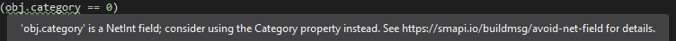

&larr; [SMAPI](../README.md)

The **mod build package** is an open-source NuGet package which automates the MSBuild configuration
for SMAPI mods and related tools. The package is fully compatible with Linux, macOS, and Windows.

## Contents
* [Use](#use)
* [Features](#features)
* [Configure](#configure)
* [Code warnings](#code-warnings)
* [FAQs](#faqs)
  * [How do I set the game path?](#custom-game-path)
  * [How do I change which files are included in the mod deploy/zip?](#how-do-i-change-which-files-are-included-in-the-mod-deployzip)
  * [Can I use the package for non-mod projects?](#can-i-use-the-package-for-non-mod-projects)
* [For SMAPI developers](#for-smapi-developers)
* [Release notes](#release-notes)

## Use
1. Create an empty library project.
2. Reference the [`Pathoschild.Stardew.ModBuildConfig` NuGet package](https://www.nuget.org/packages/Pathoschild.Stardew.ModBuildConfig).
3. [Write your code](https://stardewvalleywiki.com/Modding:Creating_a_SMAPI_mod).
4. Compile on any platform.
5. Run the game to play with your mod.

## Features
The package includes several features to simplify mod development (see [_configure_](#configure) to
change how these work):

* **Detect game path:**  
  The package automatically finds your game folder by scanning the default install paths and
  Windows registry. It adds two MSBuild properties for use in your `.csproj` file if needed:
  `$(GamePath)` and `$(GameModsPath)`.

* **Add assembly references:**  
  The package adds assembly references to MonoGame, SMAPI, Stardew Valley, and xTile. It
  automatically adjusts depending on which OS you're compiling it on. If you use
  [Harmony](https://stardewvalleywiki.com/Modding:Modder_Guide/APIs/Harmony), it can optionally add
  a reference to that too.

* **Copy files into the `Mods` folder:**  
  The package automatically copies your mod's DLL and PDB files, `manifest.json`, [`i18n`
  files](https://stardewvalleywiki.com/Modding:Translations) (if any), and the `assets` folder (if
  any) into the `Mods` folder when you rebuild the code, with a subfolder matching the mod's project
  name. That lets you try the mod in-game right after building it.

* **Create release zip:**  
  The package adds a zip file in your project's `bin` folder when you rebuild the code, in the
  format recommended for uploading to mod sites like Nexus Mods. This includes the same files as
  the previous feature.

* **Launch or debug mod:**  
  On Windows only, the package configures Visual Studio so you can launch the game and attach a
  debugger using _Debug > Start Debugging_ or _Debug > Start Without Debugging_. This lets you [set
  breakpoints](https://docs.microsoft.com/en-us/visualstudio/debugger/using-breakpoints?view=vs-2019)
  in your code while the game is running, or [make simple changes to the mod code without needing to
  restart the game](https://docs.microsoft.com/en-us/visualstudio/debugger/edit-and-continue?view=vs-2019).
  This is disabled on Linux/macOS due to limitations with the Mono wrapper.

* **Preconfigure common settings:**  
  The package automatically enables `.pdb` files (so error logs show line numbers to simplify
  debugging), and enables support for the simplified SDK-style `.csproj` format.

* **Add code warnings:**  
  The package runs code analysis on your mod and raises warnings for some common errors or
  pitfalls. See [_code warnings_](#code-warnings) for more info.

## Configure
### How to set options
You can configure the package by setting build properties, which are essentially tags like this:
```xml
<PropertyGroup>
    <ModFolderName>CustomModName</ModFolderName>
    <EnableModDeploy>false</EnableModDeploy>
</PropertyGroup>
```

There are two places you can put them:

* **Global properties** apply to every mod project you open on your computer. That's recommended
  for properties you want to set for all mods (e.g. a custom game path). Here's where to put them:

  1. Open the home folder on your computer (see instructions for
     [Linux](https://superuser.com/questions/409218/where-is-my-users-home-folder-in-ubuntu),
     [macOS](https://www.cnet.com/how-to/how-to-find-your-macs-home-folder-and-add-it-to-finder/),
     or [Windows](https://www.computerhope.com/issues/ch000109.htm)).
  2. Create a `stardewvalley.targets` file with this content:
     ```xml
     <Project>
        <PropertyGroup>
        </PropertyGroup>
     </Project>
     ```
  3. Add the properties between the `<PropertyGroup>` and `</PropertyGroup>`.

* **Project properties** apply to a specific project. This is mainly useful for mod-specific
  options like the mod name. Here's where to put them:

  1. Open the folder containing your mod's source code.
  2. Open the `.csproj` file in a text editor (Notepad is fine).
  3. Add the properties between the first `<PropertyGroup>` and `</PropertyGroup>` tags you find.

### Available properties
These are the options you can set:

<ul>
<li>Game properties:
<table>
<tr>
  <th>property</th>
  <th>effect</th>
</tr>
<tr>
<td><code>GamePath</code></td>
<td>

The absolute path to the Stardew Valley folder. This is auto-detected, so you usually don't need to
change it.

</td>
</tr>
<tr>
<td><code>GameModsPath</code></td>
<td>

The absolute path to the folder containing the game's installed mods (defaults to
`$(GamePath)/Mods`), used when deploying the mod files.

</td>
</tr>
<tr>
</table>
</li>

<li>Mod build properties:
<table>
<tr>
  <th>property</th>
  <th>effect</th>
</tr>
<tr>
<td><code>EnableHarmony</code></td>
<td>

Whether to add a reference to [Harmony](https://stardewvalleywiki.com/Modding:Modder_Guide/APIs/Harmony)
(default `false`). This is only needed if you use Harmony.

</td>
</tr>
<tr>
<td><code>EnableModDeploy</code></td>
<td>

Whether to copy the mod files into your game's `Mods` folder (default `true`).

</td>
</tr>
<tr>
<td><code>EnableModZip</code></td>
<td>

Whether to create a release-ready `.zip` file in the mod project's `bin` folder (default `true`).

</td>
</tr>
<tr>
<td><code>ModFolderName</code></td>
<td>

The mod name for its folder under `Mods` and its release zip (defaults to the project name).

</td>
</tr>
<tr>
<td><code>ModZipPath</code></td>
<td>

The folder path where the release zip is created (defaults to the project's `bin` folder).

</td>
</tr>
</table>
</li>

<li>Specialized properties:
<table>
<tr>
  <th>property</th>
  <th>effect</th>
</tr>
<tr>
<td><code>BundleExtraAssemblies</code></td>
<td>

**Most mods should not change this option.**

By default (when this is _not_ enabled), only the mod files [normally considered part of the
mod](#Features) will be added to the release `.zip` and copied into the `Mods` folder (i.e.
"deployed"). That includes the assembly files (`*.dll`, `*.pdb`, and `*.xml`) for your mod project,
but any other DLLs won't be deployed.

Enabling this option will add _all_ dependencies to the build output, then deploy _some_ of them
depending on the comma-separated value(s) you set:

<table>
<tr>
  <th>option</th>
  <th>result</th>
</tr>
<tr>
<td><code>ThirdParty</code></td>
<td>

Assembly files which don't match any other category.

</td>
</tr>
<tr>
<td><code>System</code></td>
<td>

Assembly files whose names start with `Microsoft.*` or `System.*`.

</td>
</tr>
<tr>
<td><code>Game</code></td>
<td>

Assembly files which are part of MonoGame, SMAPI, or Stardew Valley.

</td>
</tr>
<tr>
<td><code>All</code></td>
<td>

Equivalent to `System, Game, ThirdParty`.

</td>
</tr>
</table>

Most mods should omit the option. Some mods may need `ThirdParty` if they bundle third-party DLLs
with their mod. The other options are mainly useful for unit tests.

When enabling this option, you should **manually review which files get deployed** and use the
`IgnoreModFilePaths` or `IgnoreModFilePatterns` options to exclude files as needed.

</td>
</tr>
<tr>
<td><code>EnableGameDebugging</code></td>
<td>

Whether to configure the project so you can launch or debug the game through the _Debug_ menu in
Visual Studio (default `true`). There's usually no reason to change this, unless it's a unit test
project.

</td>
</tr>
<tr>
<td><code>IgnoreModFilePaths</code></td>
<td>

A comma-delimited list of literal file paths to ignore, relative to the mod's `bin` folder. Paths
are case-sensitive, but path delimiters are normalized automatically. For example, this ignores a
set of tilesheets:

```xml
<IgnoreModFilePaths>assets/paths.png, assets/springobjects.png</IgnoreModFilePaths>
```

</td>
</tr>
<tr>
<td><code>IgnoreModFilePatterns</code></td>
<td>

A comma-delimited list of regex patterns matching files to ignore when deploying or zipping the mod
files (default empty). For crossplatform compatibility, you should replace path delimiters with `[/\\]`.

For example, this excludes all `.txt` and `.pdf` files, as well as the `assets/paths.png` file:

```xml
<IgnoreModFilePatterns>\.txt$, \.pdf$, assets[/\\]paths.png</IgnoreModFilePatterns>
```

</td>
</tr>
</table>
</li>
</ul>

## Code warnings
### Overview
The NuGet package adds code warnings in Visual Studio specific to Stardew Valley. For example:  


You can [hide the warnings](https://visualstudiomagazine.com/articles/2017/09/01/hide-compiler-warnings.aspx)
if needed using the warning ID (shown under 'code' in the Error List).

See below for help with specific warnings.

### Avoid implicit net field cast
Warning text:
> This implicitly converts '{{expression}}' from {{net type}} to {{other type}}, but
> {{net type}} has unintuitive implicit conversion rules. Consider comparing against the actual
> value instead to avoid bugs.

Stardew Valley uses net types (like `NetBool` and `NetInt`) to handle multiplayer sync. These types
can implicitly convert to their equivalent normal values (like `bool x = new NetBool()`), but their
conversion rules are unintuitive and error-prone. For example,
`item?.category == null && item?.category != null` can both be true at once, and
`building.indoors != null` can be true for a null value.

Suggested fix:
* Some net fields have an equivalent non-net property like `monster.Health` (`int`) instead of
  `monster.health` (`NetInt`). The package will add a separate [AvoidNetField](#avoid-net-field) warning for
  these. Use the suggested property instead.
* For a reference type (i.e. one that can contain `null`), you can use the `.Value` property:
  ```c#
  if (building.indoors.Value == null)
  ```
  Or convert the value before comparison:
  ```c#
  GameLocation indoors = building.indoors;
  if(indoors == null)
     // ...
  ```
* For a value type (i.e. one that can't contain `null`), check if the object is null (if applicable)
  and compare with `.Value`:
  ```cs
  if (item != null && item.category.Value == 0)
  ```

### Avoid net field
Warning text:
> '{{expression}}' is a {{net type}} field; consider using the {{property name}} property instead.

Your code accesses a net field, which has some unusual behavior (see [AvoidImplicitNetFieldCast](#avoid-implicit-net-field-cast)).
This field has an equivalent non-net property that avoids those issues.

Suggested fix: access the suggested property name instead.

### Avoid obsolete field
Warning text:
> The '{{old field}}' field is obsolete and should be replaced with '{{new field}}'.

Your code accesses a field which is obsolete or no longer works. Use the suggested field instead.

### Wrong processor architecture
Warning text:
> The target platform should be set to 'Any CPU' for compatibility with both 32-bit and 64-bit
> versions of Stardew Valley (currently set to '{{current platform}}').

Mods can be used in either 32-bit or 64-bit mode. Your project's target platform isn't set to the
default 'Any CPU', so it won't work in both. You can fix it by [setting the target platform to
'Any CPU'](https://docs.microsoft.com/en-ca/visualstudio/ide/how-to-configure-projects-to-target-platforms).

## FAQs
### How do I set the game path?<span id="custom-game-path"></span>
The package detects where your game is installed automatically, so you usually don't need to set it
manually. If it can't find your game or you have multiple installs, you can specify the path
yourself.

To do that:

1. Get the full folder path containing the Stardew Valley executable.
2. See [_configure_](#configure) to add this property:
   ```xml
   <PropertyGroup>
       <GamePath>PATH_HERE</GamePath>
   </PropertyGroup>
   ```
3. Replace `PATH_HERE` with your game's folder path (don't add quotes).

The configuration will check your custom path first, then fall back to the default paths (so it'll
still compile on a different computer).

### How do I change which files are included in the mod deploy/zip?
* For normal files, you can [add/remove them in the build output](https://stackoverflow.com/a/10828462/262123).
* For assembly files (`*.dll`, `*.exe`, `*.pdb`, or `*.xml`), see the
  [`BundleExtraAssemblies` option](#configure).
* To exclude a file which the package copies by default, see the [`IgnoreModFilePaths` or
  `IgnoreModFilePatterns` options](#configure).

### Can I use the package for non-mod projects?
Yep, this works in unit tests and framework projects too. Just disable the mod-related package
features (see [_configure_](#configure)):

```xml
<EnableGameDebugging>false</EnableGameDebugging>
<EnableModDeploy>false</EnableModDeploy>
<EnableModZip>false</EnableModZip>
```

To copy referenced DLLs into your build output for unit tests, add this too:
```xml
<BundleExtraAssemblies>All</BundleExtraAssemblies>
```

## For SMAPI developers
The mod build package consists of three projects:

project                                           | purpose
------------------------------------------------- | ----------------
`StardewModdingAPI.ModBuildConfig`                | Configures the build (references, deploying the mod files, setting up debugging, etc).
`StardewModdingAPI.ModBuildConfig.Analyzer`       | Adds C# analyzers which show code warnings in Visual Studio.
`StardewModdingAPI.ModBuildConfig.Analyzer.Tests` | Unit tests for the C# analyzers.

The NuGet package is generated automatically in `StardewModdingAPI.ModBuildConfig`'s `bin` folder
when you compile it.

## Release notes
### 4.1.0
Released 08 January 2023.

* Added `manifest.json` format validation on build (thanks to tylergibbs2!).
* Fixed game DLLs not excluded from the release zip when they're referenced explicitly but `BundleExtraAssemblies` isn't set.

### 4.0.2
Released 09 October 2022.

* Switched to the newer crossplatform `portable` debug symbols (thanks to lanturnalis!).
* Fixed `BundleExtraAssemblies` option being partly case-sensitive.
* Fixed `BundleExtraAssemblies` not applying `All` value to game assemblies.

### 4.0.1
Released 14 April 2022.

* Added detection for Xbox app game folders.
* Fixed "_conflicts between different versions of Microsoft.Win32.Registry_" warnings in recent SMAPI versions.
* Internal refactoring.

### 4.0.0
Released 30 November 2021.

* Updated for Stardew Valley 1.5.5 and SMAPI 3.13.0. (Older versions are no longer supported.)
* Added `IgnoreModFilePaths` option to ignore literal paths.
* Added `BundleExtraAssemblies` option to copy bundled DLLs into the mod zip/folder.
* Removed the `GameExecutableName` and `GameFramework` options (since they now have the same value
  on all platforms).
* Removed the `CopyModReferencesToBuildOutput` option (superseded by `BundleExtraAssemblies`).
* Improved analyzer performance by enabling parallel execution.

**Migration guide for mod authors:**
1. See [_migrate to 64-bit_](https://stardewvalleywiki.com/Modding:Migrate_to_64-bit_on_Windows) and
   [_migrate to Stardew Valley 1.5.5_](https://stardewvalleywiki.com/Modding:Migrate_to_Stardew_Valley_1.5.5).
2. Possible changes in your `.csproj` or `.targets` files:
   * Replace `$(GameExecutableName)` with `Stardew Valley`.
   * Replace `$(GameFramework)` with `MonoGame` and remove any XNA Framework-specific logic.
   * Replace `<CopyModReferencesToBuildOutput>true</CopyModReferencesToBuildOutput>` with
     `<BundleExtraAssemblies>Game</BundleExtraAssemblies>`.
   * If you need to bundle extra DLLs besides your mod DLL, see the [`BundleExtraAssemblies`
     documentation](#configure).

### 3.3.0
Released 30 March 2021.

* Added a build warning when the mod isn't compiled for `Any CPU`.
* Added a `GameFramework` build property set to `MonoGame` or `Xna` based on the platform. This can
  be overridden to change which framework it references.
* Added support for building mods against the 64-bit Linux version of the game on Windows.
* The package now suppresses the misleading 'processor architecture mismatch' warnings.

### 3.2.2
Released 23 September 2020.

* Reworked and streamlined how the package is compiled.
* Added [SMAPI-ModTranslationClassBuilder](https://github.com/Pathoschild/SMAPI-ModTranslationClassBuilder)
  files to the ignore list.

### 3.2.1
Released 11 September 2020.

* Added more detailed logging.
* Fixed _path's format is not supported_ error when using default `Mods` path in 3.2.

### 3.2.0
Released 07 September 2020.

* Added option to change `Mods` folder path.
* Rewrote documentation to make it easier to read.

### 3.1.0
Released 01 February 2020.

* Added support for semantic versioning 2.0.
* `0Harmony.dll` is now ignored if the mod references Harmony directly (it's bundled with SMAPI).

### 3.0.0
Released 26 November 2019.

* Updated for SMAPI 3.0 and Stardew Valley 1.4.
* Added automatic support for `assets` folders.
* Added `$(GameExecutableName)` MSBuild variable.
* Added support for projects using the simplified `.csproj` format.
* Added option to disable game debugging config.
* Added `.pdb` files to builds by default (to enable line numbers in error stack traces).
* Added optional Harmony reference.
* Fixed `Newtonsoft.Json.pdb` included in release zips when Json.NET is referenced directly.
* Fixed `<IgnoreModFilePatterns>` not working for `i18n` files.
* Dropped support for older versions of SMAPI and Visual Studio.
* Migrated package icon to NuGet's new format.

### 2.2.0
Released 28 October 2018.

* Added support for SMAPI 2.8+ (still compatible with earlier versions).
* Added default game paths for 32-bit Windows.
* Fixed valid manifests marked invalid in some cases.

### 2.1.0
Released 27 July 2018.

* Added support for Stardew Valley 1.3.
* Added support for non-mod projects.
* Added C# analyzers to warn about implicit conversions of Netcode fields in Stardew Valley 1.3.
* Added option to ignore files by regex pattern.
* Added reference to new SMAPI DLL.
* Fixed some game paths not detected by NuGet package.

### 2.0.2
Released 01 November 2017.

* Fixed compatibility issue on Linux.

### 2.0.1
Released 11 October 2017.

* Fixed mod deploy failing to create subfolders if they don't already exist.

### 2.0.0
Released 11 October 2017.

* Added: mods are now copied into the `Mods` folder automatically (configurable).
* Added: release zips are now created automatically in your build output folder (configurable).
* Added: mod deploy and release zips now exclude Json.NET automatically, since it's provided by SMAPI.
* Added mod's version to release zip filename.
* Improved errors to simplify troubleshooting.
* Fixed release zip not having a mod folder.
* Fixed release zip failing if mod name contains characters that aren't valid in a filename.

### 1.7.1
Released 28 July 2017.

* Fixed issue where i18n folders were flattened.
* The manifest/i18n files in the project now take precedence over those in the build output if both
  are present.

### 1.7.0
Released 28 July 2017.

* Added option to create release zips on build.
* Added reference to XNA's XACT library for audio-related mods.

### 1.6.2
Released 10 July 2017.

* Further improved crossplatform game path detection.
* Removed undocumented `GamePlatform` build property.

### 1.6.1
Released 09 July 2017.

* Improved crossplatform game path detection.

### 1.6.0
Released 05 June 2017.

* Added support for deploying mod files into `Mods` automatically.
* Added a build error if a game folder is found, but doesn't contain Stardew Valley or SMAPI.

### 1.5.0
Released 23 January 2017.

* Added support for setting a custom game path globally.
* Added default GOG path on macOS.

### 1.4.0
Released 11 January 2017.

* Fixed detection of non-default game paths on 32-bit Windows.
* Removed support for SilVerPLuM (discontinued).
* Removed support for overriding the target platform (no longer needed since SMAPI crossplatforms
  mods automatically).

### 1.3.0
Released 31 December 2016.

* Added support for non-default game paths on Windows.

### 1.2.0
Released 24 October 2016.

* Exclude game binaries from mod build output.

### 1.1.0
Released 21 October 2016.

* Added support for overriding the target platform.

### 1.0.0
Released 21 October 2016.

* Initial release.
* Added support for detecting the game path automatically.
* Added support for injecting XNA/MonoGame references automatically based on the OS.
* Added support for mod builders like SilVerPLuM.
